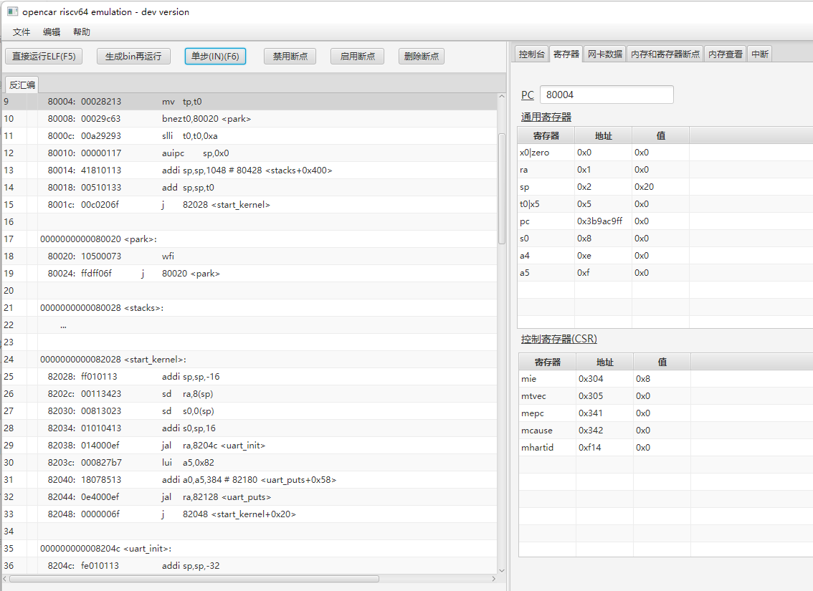
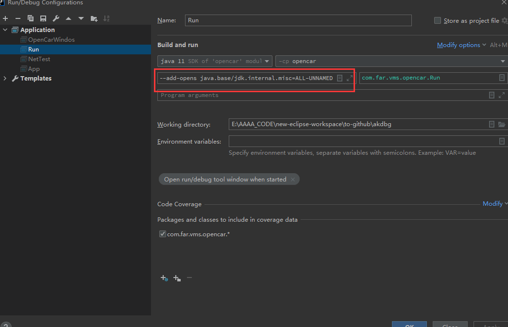

# OpenCar

> openCar 一款仿真Riscv指令集的软件，目标是提供基础的Rv指令模拟环境，实现趋近于芯片功能的仿真环境，为异构的软件生态提供方便的调试观察功能。

 人话:
- 让Jvm直接运行操作系统
- 不用买开发板就可以在openCar上测试和跟踪软件在riscv上的运行情况。
- 可以在opencar上使用C语言进行操作系统开发以及裸机开发，然后移植到真机




## openCar目标

* 支持rv64 ( I M D F A L  Zicsr) 指令集
* 支持可视化监视和跟踪指令执行
* 支持gdb指令调试，后期支持在可视化IDE中操作(变量、堆栈、内存、线程、断点)
* 支持rv机器码反汇编
* 硬件支持:
  - 串口 (ns16550A)
    - 硬件资料和操作串口的jar包连接
      >  链接：https://pan.baidu.com/s/1bjR84lC-w3SL-SPsKtLqXQ?pwd=brp8 
        - 提取码：brp8
  - 网络 
  - 硬盘
  - LCD
  
## 关于调试
> opencar在执行C语言的代码时，需要观察堆栈，变量，寄存器，内存值，外设状态和数据;并且还需要模拟LCD等显示设备，由于精力有限
> 希望有懂javafx也喜欢虚拟技术的朋友一起开发简单的汇编编辑器和汇编调试器 联系Q184377367
> 
## 想法
- 完美运行rvos
- 完美运行xv6
- 完美运行linux
- 在opencar上开发一款NES模拟器

## 相关配置
### java
- jdk11
### 编译器
- gcc riscv64-unknown-elf-toolchain-10.2.0-2020.12.8

### 开发时JVM参数配置



## 运行
- java11
```js
 ./java --module-path javafx-sdk-16\lib --add-modules javafx.controls,javafx.fxml -jar opencar-0.0.1-SNAPSHOT.jar
```


- 如果出现 cannot access class jdk.internal.misc.Unsafe 还需要运行增加
```
--add-opens java.base/jdk.internal.misc=ALL-UNNAMED
-Dio.netty.tryReflectionSetAccessible=true
```


## 如何参与贡献
- 至少会一门编程语言 java/go/c/c++/C#
- 至少有一年项目经验
- 不懂硬件能参与？ 
  - 实际上opencar除了仿真硬件部分需要硬件知识，其他很多模块只是常规的JAVA开发
- 支持native语言能在opencar项目中做什么？ 
  - 可以实现硬件仿真库给java调用
  - 将支持native的语言编译为rv64平台目标文件，进行功能验证


## 记录更新
- 2022/12/9 
  - 优化寄存器面板，数据格进制格式化后，下次显示的格式和之前的设置一致
  - 支持寄存器设置写前断点


